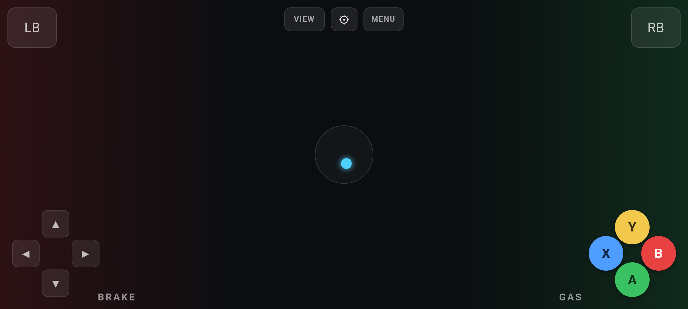

# Gyro Steering Controller for Xbox Cloud Gaming

Turn your phone into a racing wheel (and a full controller) for Xbox Cloud
Gaming (xCloud), played in a desktop browser. Steer with your phone's gyro,
use on-screen pedals/buttons for everything else — no extra hardware, no
kernel drivers.

Built for Forza and F1, but works with any racing/driving title on xCloud
since it doesn't touch anything game-specific.



## How it works

xCloud reads controller input via the standard browser [Gamepad
API](https://developer.mozilla.org/en-US/docs/Web/API/Gamepad_API)
(`navigator.getGamepads()`). A Chrome/Edge extension overrides that function
on `xbox.com/play`, merging live input streamed from your phone into the
Gamepad object the game reads every frame.

```
Phone (browser)                  Mac (Chrome/Edge on xbox.com/play)
┌────────────────────┐            ┌──────────────────────────────────┐
│ Gyro (steering X/Y) │  WebSocket │ Local relay (Node) — broadcasts  │
│ Touch pedals/buttons│───────────>│ phone state to the extension     │
└────────────────────┘            │                                   │
                                    │ Extension:                       │
                                    │  - bridge.js: WS client          │
                                    │  - inject.js: overrides          │
                                    │    getGamepads(), merges phone   │
                                    │    input into the real or a      │
                                    │    synthetic virtual controller  │
                                    └──────────────────────────────────┘
```

Two modes, chosen on the phone:

- **Assist** — merges into your real Bluetooth/USB controller. Whichever
  input (real stick or phone tilt, real button or phone touch) is pushed
  further wins, so both keep working side by side.
- **Player** — the phone becomes its own fully synthetic controller (no real
  hardware needed), at a chosen player slot, for local co-op.

## Features

- Gyro steering, both axes (left/right roll + forward/back pitch)
- Analog throttle/brake pedals (drag position = pressure)
- Full button set: A/B/X/Y (Xbox-colored), LB/RB shift paddles, View/Menu,
  D-pad
- Live tilt indicator (no need to look away from the game to check centering)
- Local co-op: multiple phones as separate players (see prerequisite below)
- Fullscreen + landscape lock on the phone, one tap

## Setup

### 1. Load the extension

`chrome://extensions` → enable Developer Mode → **Load unpacked** → select
the `extension/` folder.

### 2. Start the relay

Double-click `start.command` (first run: right-click → Open, since macOS
Gatekeeper blocks unsigned scripts otherwise). It prints a URL for your
phone.

### 3. Connect your phone

Visit the printed `http://<mac-lan-ip>:8765/` URL on your phone (same
Wi-Fi). Pick **Assist** or **Player N**, tap **Go Fullscreen (Landscape) &
Start**.

> **Android gotcha:** Chrome blocks gyro sensors on plain `http://` origins.
> Add your relay's URL under
> `chrome://flags/#unsafely-treat-insecure-origin-as-secure` on the phone and
> relaunch Chrome.

### 4. Play

Open `xbox.com/play` in Chrome/Edge on the Mac, launch a racing game with
your controller connected. Tilt the phone to steer.

## Local co-op (multiple phones)

Requires [better-xcloud](https://github.com/redphx/better-xcloud) installed,
with its **Local Co-Op** toggle enabled. better-xcloud patches xCloud's own
input handling to recognize distinct gamepad indices as separate players;
this project just needs to occupy those extra indices, one per phone set to
**Player** mode with a unique slot number.

## Credits / prior art

This project builds on ideas and confirmed techniques from:

- **[better-xcloud](https://github.com/redphx/better-xcloud)** — the
  reference for how xCloud's input pipeline actually works, its Local Co-Op
  patch, and its virtual-gamepad + `gamepadconnected` event technique for
  keyboard-as-controller. Also a required companion for multiplayer mode.
- **[xCloudWheel](https://xcloudwheel.com/)** — proved that overriding
  `navigator.getGamepads()` to fuse a non-standard input device into a
  synthetic standard-gamepad shape works reliably on xCloud specifically.
- **[sandrotaje/gamepad-emulator](https://github.com/sandrotaje/gamepad-emulator)**,
  **CloudGamepad**, **ControlStadia** — prior art for `getGamepads()`
  injection/remapping on cloud gaming sites.

## Known limitations

- Chrome/Edge only — no confirmed equivalent to `world: "MAIN"` content
  script injection on Safari.
- Local co-op depends entirely on better-xcloud's patch; without it,
  multiple gamepad indices may collapse into a single xCloud player.
- No packaging yet — extension is load-unpacked/dev-mode only.

## License

MIT

---

Vibe coded by Garv.
